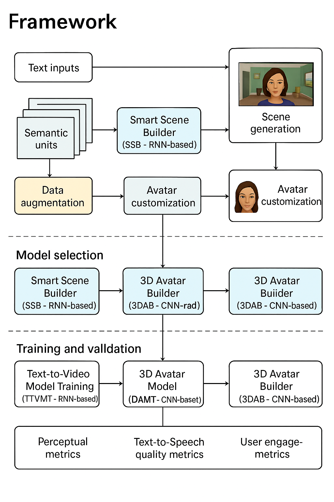
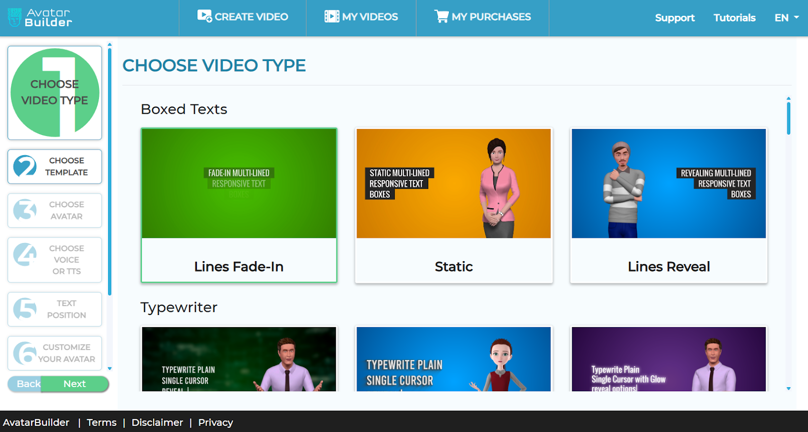
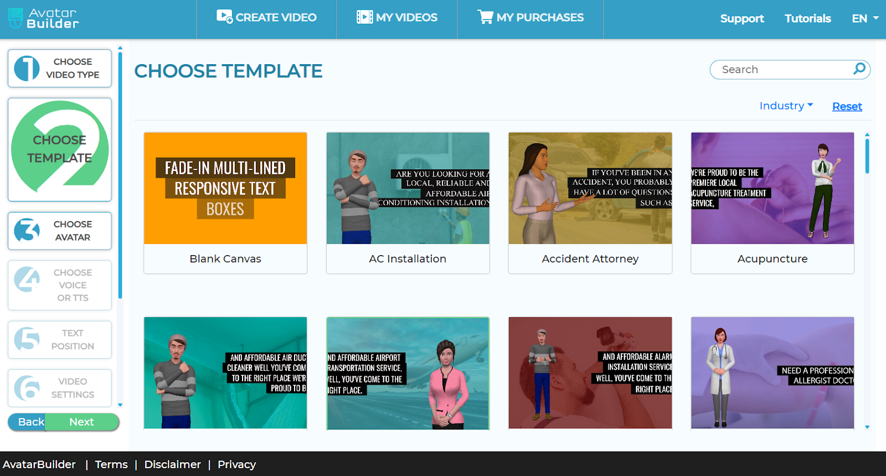
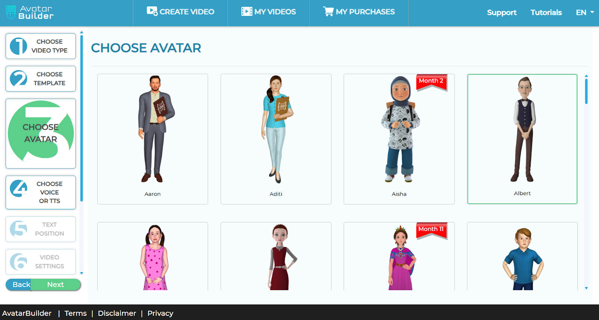
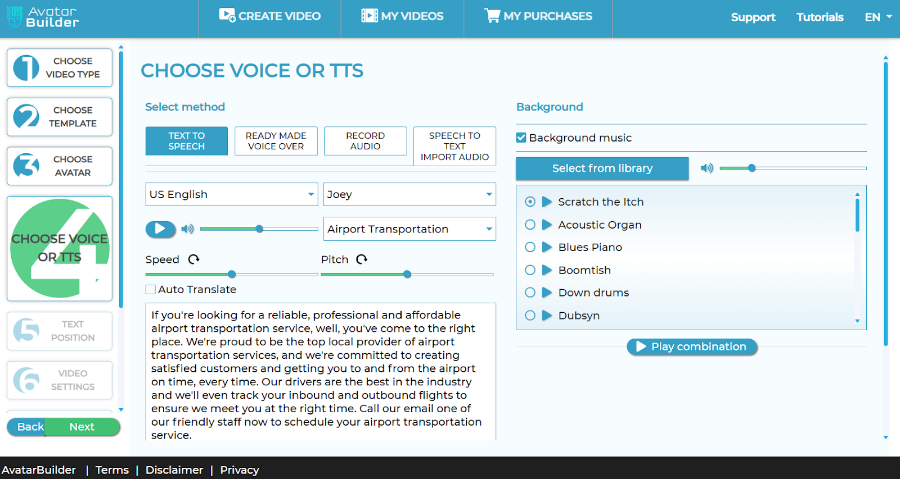
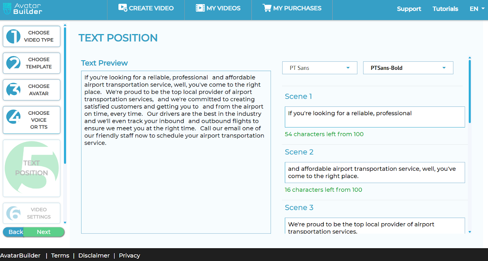
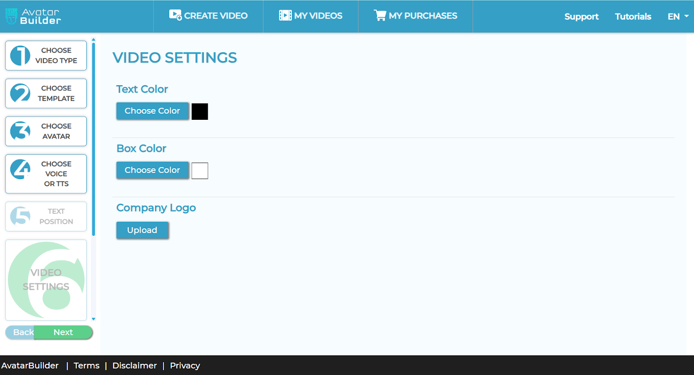
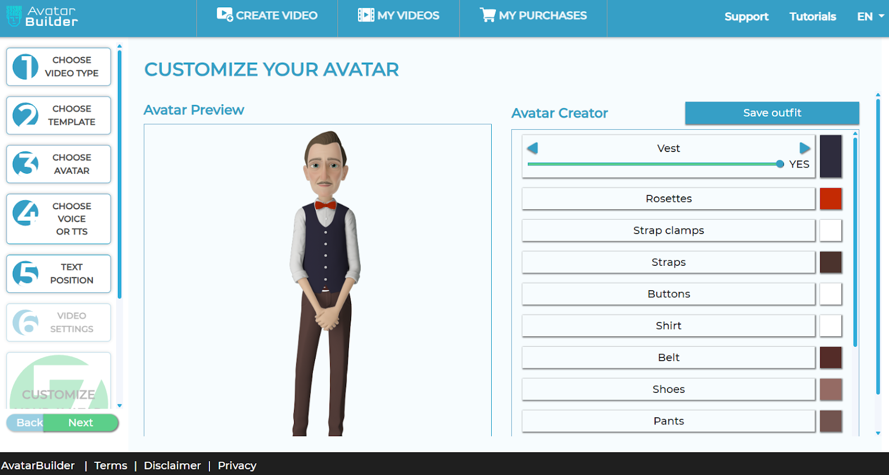

# 🎬 AvatarBuilder – AI-Powered Video Creation Platform

**AvatarBuilder** is an AI-powered platform that simplifies video creation for everyone. It allows users to build engaging videos using **fully customizable 3D avatars** paired with **smart AI-generated scenes**. No video editing or design skills required—just type your script, pick your avatar, and AvatarBuilder handles the rest.

---

## 🗂 Scheme

---

## 🔗 Samples

<table>
    <tbody>
        <tr>
            <td>
                
            </td>
            <td>
                
            </td>
            <td>
                
            </td>
        </tr>
        <tr>
            <td>
                
            </td>
            <td>
                
            </td>
            <td>
                
            </td>
        </tr>
        <tr>
            <td></td>
            <td>
                
            </td>
            <td></td>
        </tr>
    </tbody>
</table>

<table>
<thead>
<tr>
<th>Final Video Samples:</th>
<th>Paul Video Demo:</th>
</tr>
</thead>
<tbody>
<tr>
<td width="50%">
<video src="https://github.com/user-attachments/assets/d1da203e-b9db-4f4f-8095-02e52fa16523" controls preload>
Your browser does not support the video tag.
</video>
</td>
<td width="50%">

</td>
</tr>
</tbody>
</table>

---

## 📝 Overview

AvatarBuilder transforms text into **dynamic video content** with customizable talking 3D avatars and AI-generated scenes. It is designed for:

- Marketing
- Education
- Training
- Social Media

**Key Benefits:**

- Simplifies scene design
- Supports multiple use cases
- Affordable, professional-quality video creation

---

## ⚠️ Problems Addressed

1. High costs of professional video production
2. Time-consuming background and avatar customization
3. Difficulty in creating videos that align with branding
4. Limited access to affordable and versatile video creation tools

---

## 💡 Solutions

AvatarBuilder offers:

- **Customizable 3D avatars** that talk and express emotions
- **AI Scene Creator** for automated scene generation
- **Intuitive UI** for seamless user experience
- **Analytics** for tracking video performance
- **Budget-friendly** pricing for creators and businesses

---

## 🛠️ Process

### 1️⃣ Preprocessing

- Break down text inputs into semantic units
- Augment data for diverse scene generation

### 2️⃣ Model Selection

| Component | Model Type | Purpose |
|-----------|------------|--------|
| Smart Scene Builder (SSB) | RNN | Converts text into dynamic video scenes |
| 3D Avatar Builder (3DAB) | CNN | Generates customizable 3D avatars |

### 3️⃣ Training & Validation

- **Text-to-Video Model (RNN-based)**: Learns scene generation from text
- **3D Avatar Model (CNN-based)**: Learns facial & body expressions for avatars
- **Validation**: Ensures generalization and avoids overfitting

### 4️⃣ Evaluation Metrics

- **Visual Quality:** SSI, PSNR
- **Text-to-Speech Quality:** Naturalness, fluency, pronunciation
- **User Engagement:** Click-through rate, completion rate, feedback

---

## 🏆 Achievements

- 90% **user satisfaction rate** with intuitive interface
- Up to **40% time savings** in video creation
- 70% **reduction in production costs**
- Successfully used for marketing, education, and social content
- AI-driven **script suggestions** reduce development time by 25%

---

## 🔮 Future Enhancements

1. Extended language and accent support, with real-time translation
2. **AR integration** for avatars in real-world environments
3. Interactive scripting for immersive storytelling
4. AI-based content recommendations
5. Educational & training modules
6. VR platform integration for immersive avatar experiences

---

## 🛠️ Technologies Used

- **Frameworks:** NLTK, TensorFlow, Scikit-Learn, OpenCV, FFmpeg
- **Languages:** Python
- **Tools & Platforms:** Google Cloud, NVIDIA CUDA, Docker

---

## 📚 References

1. "The Rise of AI in Digital Avatars: Trends and Opportunities" – AI Magazine, 2021
2. "AR Technologies Reshaping Interactive Storytelling" – Journal of Augmented Reality Experiences, 2022
3. "The Role of Virtual Avatars in Educational Technology" – Journal of Educational Technology Research, 2020
4. "Sequence to Sequence Learning with Neural Networks" – Ilya Sutskever et al.
5. "Virtual Reality Platforms: Shaping the Future of User Interaction" – Virtual Reality Journal, 2021  
